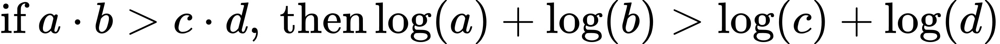

### Part 1

#### Details:

Part 1 can be divided into several sub-parts. First, since the input is string type, we transform string into list type in order to deal with the data easily. Second, we find all possible moves of current player within current board, named as succssor states. In this step, we can regard it as a tree. We will find the successors, and the successors of these successors, within the depth of H. The reason we want to choose depth of H instead of fully expand the tree is because, if we choose to expand the whole tree, the time complexity will be super high. Instead of expanding the whole game tree, we choose to only expand the tree, start from the given initial state, end at the depth of H. Assume the time complexity of expanding the whole game tree be O(b ^ d), the time complexity for computing this game tree will be O(b ^ H), where b is the branching factor of each tree level. After we expand the game tree to the depth of H, we start using minimax algorithm. For each evaluation value of the node (state) in the tree, we will use the number of the chess remained of one player, minus the number of the chess remained of another player. The player here is defined as the input, for example, if the initial input is 'w', that means we will use the number of the chess remained of player "white", minus the number of the chess remained of player "black". For each min-node level, we will use the min evaluation value from current state's corresponding children's level. For each max-node level, we will use the max evaluation value from current state's corresponding children's level. Let's say the top level contains the initial input state. By this way of calculation, we will find the max value from the second top level, and the corresponding state map is the best next move for the input player to play.
Also, we can also use alpha-beta pruning algorithm to improve the time complexity. Start from the bottom level again, use the same strategy what we have used in minimax algorithm. But this time, instead of visiting all the successors in the bound of depth H, we will keep updating the alpha value (the lower bound of the max nodes) and beta value (the upper bound of the min nodes). If the values from lower level do not satisfy the bounds of alpha value/beta value, we will not visit the any of the branches of this node. By this way, obviously we will visit less nodes than the previous algorithm, therefore the time complexity has been improved.

### Part2

#### Initial structure

The original of part2's code was a simple naive bayes problem. We need to make a summation statistics work to build a "bag of words" and each word's percentage in the whole training dataset. To better implement this, I choose to remove most unnecessary punctuation characters, like '(', '/', "'", '+', '!', '.', ':', ',', '"', '?', '*', '&', etc.

So far, the basic formula in our project looks like:

#### Further improvement

If we don't optimize our algorithm, the accuracy of our original algorithm is about 56.5%, only a little better than "random guess". We need to modify our algorithm as follows:

1. Logarithm probability:    
  

2. Smoothing algorithm to handle "very few occurance (including 0 occurance)": there are some wods that exists very little times in either training or testing, and calculating "probability -> 0" really affects probability calculation, thus we use:
    
  
    

So finally we choose smoothing parameter = 0.5 in our project. We get this result by trying smoothing=0, 0.05, 0.1, 0.15, 0.2 ... and find that smoothing=0.4~0.5 fits our project best. 

The final overall accuracy is around 87%.
